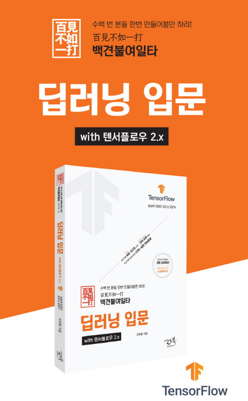

# 백견불여일타 딥러닝 입문 with 텐서플로우 2.x

백견불여일타 딥러닝 코드 저장소입니다.  
텐서플로우와 케라스를 활용한 각종 입문 예제가 포함되어 있습니다.

### 저자 및 출판사 소개

저자 : 조휘용 
저자 블로그 : https://hwiyong.tistory.com/  

출판사: (주)로드북(https://roadbook.co.kr/)  

### 정정 사항

저자 메일과 백타불여일견 카페를 통해 소통해요.  
+ e-mail: airplane2230@naver.com
+ 네이버 카페: https://cafe.naver.com/codefirst

### Code & Solution
- code : 본문 예제 코드가 있습니다.
- solutions : '실습해봅시다'의 해결 방법이 있습니다.

### 동작 버전 확인
- (출간) TensorFlow 2.0v, 2.1v을 통한 original code 작성
- (Ok) TensorFlow 2.3v
- (Ok) TensorFlow 2.4v
